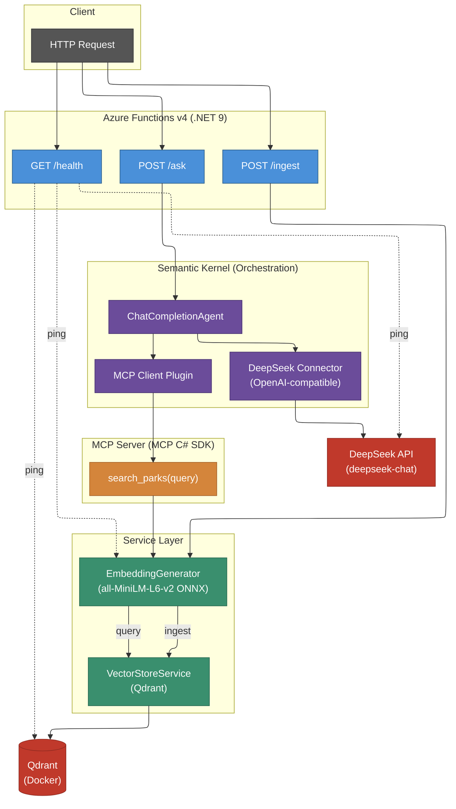

# ParkKnowledgeAPI

Azure Functions v4 API powered by Semantic Kernel, Qdrant vector search, and local ONNX embeddings for national park information.

## Prerequisites

- [.NET 9 SDK](https://dotnet.microsoft.com/download/dotnet/9.0)
- [Azure Functions Core Tools v4](https://learn.microsoft.com/en-us/azure/azure-functions/functions-run-local)
- [Docker](https://www.docker.com/) (for Qdrant)

## Getting Started

1. **Start Qdrant**
   ```
   docker compose up -d
   ```

2. **Download the embedding model** (~87 MB)
   ```
   curl -L -o ParkKnowledgeAPI/Models/onnx/model.onnx https://huggingface.co/sentence-transformers/all-MiniLM-L6-v2/resolve/main/onnx/model.onnx
   ```
   > On Windows PowerShell, use `curl.exe` instead of `curl`.

3. **Build**
   ```
   cd ParkKnowledgeAPI
   dotnet build
   ```

4. **Run**
   ```
   cd ParkKnowledgeAPI
   func start
   ```

> `local.settings.json` is committed with the shared DeepSeek API key provided for this assessment — no configuration needed.

## Project Structure

```
ParkKnowledgeAPI/
  Functions/           # HTTP-triggered Azure Functions (API endpoints)
  Models/              # Domain models and DTOs
    onnx/              # all-MiniLM-L6-v2 ONNX model for local embeddings
  Services/            # Business logic and external service clients
    Interfaces/        # Service contracts
  Mcp/                 # Model Context Protocol server/tools
  Orchestration/       # Semantic Kernel agent orchestration
  Data/
    parks/             # Park knowledge base source files
  Program.cs           # App startup and DI configuration
  host.json            # Azure Functions host config
  local.settings.json  # Local environment variables (committed for assessment)
docker-compose.yml     # Qdrant vector database
```

## Architecture Diagram



## Design Decisions

### 474 parks from the NPS API

The assessment suggests picking several park pages manually. Instead, a C# script (`ScrapeNpsParks.csx`) queries the NPS API for **all 474 parks**, collecting name, state, description, directions, operating hours, and weather into structured `.txt` files. This gives the RAG system a complete knowledge base rather than a hand-picked sample.

### Embed description, store everything

Descriptions are the most **semantically meaningful** section for similarity search — a user asking "parks with glaciers" should match on description content, not driving directions or weather. Embedding the full file would dilute the signal with boilerplate (operating hours, route numbers) that adds noise to cosine similarity.

The full file content (directions, weather, hours) is stored as payload in Qdrant and returned to the LLM at query time, so no information is lost.

### One vector per park, no chunking

The embedding model (all-MiniLM-L6-v2) has a 256-token context window. Park descriptions are 36-67 words across the dataset — well within that limit. There is no text to split, so chunking and overlap logic would be dead code.

### No custom embedding wrapper

`Microsoft.SemanticKernel.Connectors.Onnx` provides `BertOnnxTextEmbeddingGenerationService` which handles tokenization, ONNX inference, mean pooling, and L2 normalization internally. Wrapping it in a custom `IEmbeddingService` would add indirection with no benefit — the SK `IEmbeddingGenerator<string, Embedding<float>>` interface is injected directly where needed.

### Deterministic point IDs

Each park code is hashed (MD5 → GUID) to produce a **stable Qdrant point ID**. Re-running `/ingest` upserts the same points instead of creating duplicates, making ingestion idempotent.

### Temperature 0 + required tool use

The agent is configured with `temperature: 0.0` and `FunctionChoiceBehavior.Required()`. The LLM **must** call `search_parks` before answering — it cannot skip retrieval and hallucinate from parametric knowledge. Temperature 0 ensures deterministic, reproducible answers for the same query.

### Streaming endpoint (`/api/v1/ask/stream`)

`POST /api/v1/ask` buffers the full LLM response before returning JSON — the client gets nothing until all tool calls and generation are complete. `/api/v1/ask/stream` uses Server-Sent Events to deliver tokens as they arrive, cutting time-to-first-token and enabling real-time UI rendering.

**Wire format** follows the OpenAI SSE convention:
```
Content-Type: text/event-stream; charset=utf-8

data: {"content":"Hello"}

data: {"content":" world"}

data: [DONE]
```

**Why it's structured this way:**
- `ParkAssistantAgent.BuildAgent()` is shared between `AskAsync` and `AskStreamingAsync` — kernel cloning, MCP tool injection, and agent construction live in one place.
- The orchestration layer returns `IAsyncEnumerable<string>`, keeping SSE/HTTP concerns out of business logic.
- The function writes directly to `HttpResponse` (returns `Task`, not `IActionResult`) because once streaming headers are sent, the status code is committed and can't change via an action result.
- Errors mid-stream are sent as an SSE error event (`data: {"error":"..."}`) followed by `data: [DONE]`, since the 200 status is already on the wire.

## Scalability Considerations

- **Azure Functions** scale horizontally by default — each instance loads its own ONNX model in-process, so embedding throughput scales linearly with instance count. The Kernel and agent are registered as Transient to avoid cross-request state issues under concurrency.
- **Qdrant** supports sharding and replication for production workloads. The current single-node Docker setup is suitable for the 474-park dataset; for millions of vectors, Qdrant's distributed mode partitions data across nodes automatically.
- **MCP server** runs in-process via memory pipes (no network hop), keeping tool-call latency minimal. It is registered as a Singleton to share a single server/client pair across concurrent requests.
- **Ingestion** batches all embeddings in a single `GenerateAsync` call. For significantly larger datasets, this could be partitioned into fixed-size batches to bound memory usage.
- **DeepSeek API** is the main external bottleneck — response latency depends on token count and upstream load. The agent is ephemeral per request, so concurrent `/ask` calls are independent.

## Key Dependencies

| Package | Purpose |
|---|---|
| Microsoft.SemanticKernel | LLM orchestration and plugin system |
| Microsoft.SemanticKernel.Agents.Core | ChatCompletionAgent for single-agent orchestration |
| Microsoft.SemanticKernel.Connectors.OpenAI | OpenAI-compatible LLM connector (DeepSeek) |
| ModelContextProtocol | MCP server for tool exposure |
| Qdrant.Client | Vector database client |
| Microsoft.ML.OnnxRuntime | Local embedding generation (all-MiniLM-L6-v2) |
